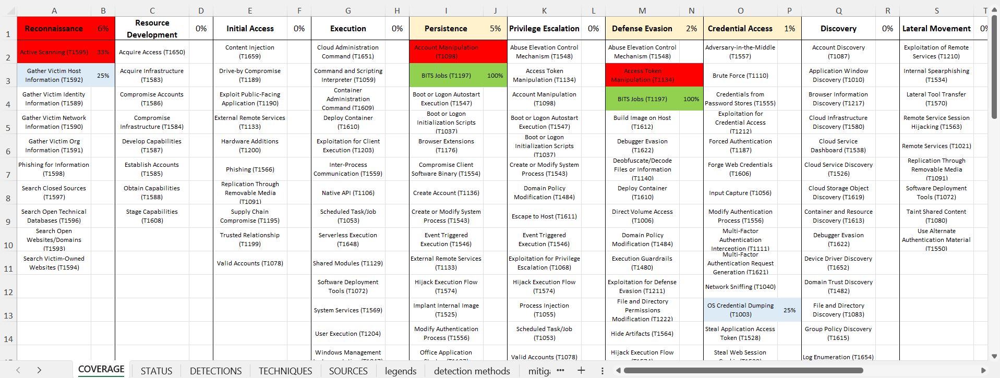

# Enhanced MITRE ATT&CK® Coverage Tracker

Welcome to the Enhanced MITRE ATT&CK® Coverage Tracker, a streamlined and excel-centric approach designed for Security Operations Centers (SOCs) to manage and measure the coverage of MITRE ATT&CK® tactics and techniques. This project aims to provide SOC analysts and security consultants with a simple, portable, and effective tool for gaining insights into their defensive capabilities against cyber threats.

> Built on top of MITRE ATT&CK® framework as of ATT&CK v16.1, October 31, 2024 - CURRENT.

## Screenshots
### Coverage
Provides a visual representation of detection coverage across the ATT&CK framework, highlighting well-covered areas and those requiring further attention. It's essential for quick assessments and strategic planning for coverage improvement.

### Techniques
Focused on the individual techniques outlined by MITRE ATT&CK®, this sheet allows for detailed mapping of detection rules against specific techniques and sub-techniques. Users can document their detection coverage, note available data sources, and identify areas lacking detection capability.

### Detections
The core of the workbook, where users input and manage their specific detection rules. This sheet enables mapping these rules to ATT&CK techniques and sub-techniques, facilitating a clear view of coverage and gaps in detection capabilities.

### Sources
Lists the data sources that can be leveraged to detect the techniques, allowing for a comprehensive check of whether the necessary data is being collected for effective detection and response.

## Project Goal

The core of this project is the Excel file, `MITRE ATT&CK Enterprise Matrix for SOC.xlsx`, tailored to assess the coverage of MITRE ATT&CK® tactics and techniques based on your detection rules. This tool is crafted for DFIR consultants and SOC analysts working across various environments, offering a unique way to visualize the readiness against attacker tactics and pinpointing areas needing improvement.

## Features of the Coverage Tracker

- **Comprehensive Worksheets**: The Excel workbook is divided into intuitive worksheets, each designed to facilitate different aspects of your analysis. From inputting detection rules to visualizing technique coverage, the worksheets serve as a guide through your ATT&CK® coverage journey.
- **User-Friendly Design**: With a mix of colored headers for ease of navigation - gray for static fields, blue for calculated values, and white for user inputs - the workbook is designed for straightforward use. Focus on white columns for inputs to mark detection rules as active or to map them to specific ATT&CK® techniques.
- **Detailed Guidance**: From adding your first detection rule to understanding the coverage of techniques and sub-techniques, the documentation guides you every step of the way. Visual indicators, such as red for inconsistencies and green for detected techniques, make it easy to assess your SOC's readiness at a glance.

# Excel Workbook Guide for MITRE ATT&CK® Coverage
Welcome to the comprehensive guide for utilizing the Excel workbook to track and enhance your security operations center's (SOC) coverage of the MITRE ATT&CK® framework. This document will walk you through each step, from adding your first detection rule to customizing the workbook to fit unique needs.

## Getting Started with Detection Rules
### Adding Your First Detection Rule
The journey to enhance your defensive capabilities starts in the Detections worksheet. This sheet is the heart of the workbook where you'll catalog your SOC's detection rules.

* The Worksheet Layout: The first four columns are provided as examples. You're encouraged to tailor these columns to suit your needs, except for the "is active" and "attack1..3" columns which are essential for the workbook's logic.
* Activating a Detection Rule: To activate a detection rule, simply input "yes" in the appropriate column. This action signifies that the rule is currently in use.
* Mapping to Techniques: Utilize the "attack1..3" columns to map your detection rule to specific ATT&CK techniques or sub-techniques, such as attempting to access LSASS Memory (sub-technique T1003.001).

### The Techniques Worksheet
After mapping your detection rule, switch to the Techniques worksheet to observe the impact. You might notice lines highlighted in red, indicating an inconsistency - a detection rule exists without the necessary data source for detection.

* Resolving Inconsistencies: To rectify this, verify the "data source available" column. If it reports zero, you'll need to ensure that the corresponding data source is marked as "yes" in the Sources worksheet.

## Enhancing Your Coverage
### Understanding Coverage and Status
The Status and Coverage worksheets provide a visual representation of your current detection capabilities:

* Status Worksheet: Offers a snapshot of what techniques and sub-techniques are currently detected by your rules, as well as those missing detection entirely.
* Coverage Worksheet: Provides a percentage-based overview of your detection rule coverage against the total techniques listed under each tactic.

## Customizing and Expanding Coverage
### Adding New Techniques
If you encounter a new sub-technique not included in the framework, you can add it directly to the detections worksheet and link it to the relevant technique.

### Adjusting for Direct Technique Detection
In cases where a technique with sub-techniques receives a direct detection rule, adjust the "detection rules modifier" column to account for this. This ensures your coverage calculation remains accurate.

### Disabling Irrelevant Techniques
Utilize the "detection rules modifier" in the techniques worksheet to disable any technique or sub-technique not relevant to your environment, such as those specific to operating systems you do not use.

### Managing Custom Data Sources
If your SOC utilizes data sources not listed in the ATT&CK framework, add these to the Sources worksheet and update the techniques accordingly to reflect these new sources.

## Future Updates

Stay tuned for updates to the Excel file, including enhancements and expansions to accommodate new versions of the MITRE ATT&CK framework. Your feedback and contributions are welcome to help evolve this tool.

## Credits

Special thanks to Roberto Rodriguez (@Cyb3rWard0g) & RealityNet, which inspired this project.
https://cyberwardog.blogspot.com/2017/07/how-hot-is-your-hunt-team.html
https://github.com/RealityNet/attack-coverage
